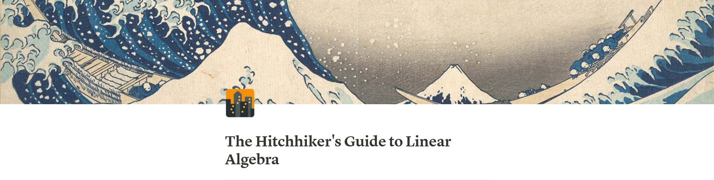

# [**The Hitchhiker's Guide to Linear Algebra**](https://www.notion.so/The-Hitchhiker-s-Guide-to-Linear-Algebra-25d07ed3ae3344468fa8faaae9c82fc7)
 

&nbsp;

2 things in mathematics always had me in awe . One was _complex number_ ( thanks to [Welch Labs](https://youtube.com/playlist?list=PLiaHhY2iBX9g6KIvZ_703G3KJXapKkNaF) and [this](https://press.princeton.edu/books/paperback/9780691169248/an-imaginary-tale) awesome book ) and other one was _linear algebra_ ( thanks to the one and only great [Grant Sanderson](https://youtube.com/playlist?list=PLZHQObOWTQDPD3MizzM2xVFitgF8hE_ab) ) . From state of the art _Machine Learning_ to the core of _Quantum Computing_ , Linear Algebra is practically everywhere . In my level 2 in undergrad , I had the chance of taking Linear Algebra Course which was a course offered from the math department . To get the CS flavour and gain better intuition , I had to dive deep into other resources (details in the Resource section) . This is some kind of hybrid of personal note + blog , contains some of the core stuffs that I had learnt and gained better intuition through this time . I have also implemented some of the basic LA algorithm stuffs in python for reference code along with the theories .

Hopefully this serves as a good starting point / refresher for anyone who is starting / practising ML / QC or anyone who is interested in general .

&nbsp;

# **Contribution & Future Plan**

This is yet to be completed . In Future , I have plans to add more applications like in ML and QC . If you are interested to contribute with anything (writeup/code/simulation) , feel free to send pull request / let me know .

&nbsp;

# **Table of Content**

## ➕ [Introduction](https://www.notion.so/Introduction-a4092131b794423aa27038cf9fb7d120)

## ➕ [Row Reduction & Echelon Forms](https://www.notion.so/Row-Reduction-Echelon-Forms-8a331eca1c4f476e9af3237d84162306)

## 🧐 [Coding LA : Part 1 (Echelon & RREF)](https://www.notion.so/Coding-LA-Part-1-Echelon-RREF-bb4ed11a9cee45d0afdf854e5ec6b78f)

&nbsp;

---

## ➕ [Vectors](https://www.notion.so/Vectors-e79564b225a04691a75fb04606bbaff4)

## ➕ [Ax = B and Ax = 0](https://www.notion.so/Ax-B-and-Ax-0-138a8c862d5e415a981a9e2559e7bc01)

## ➕ [Linear Independence](https://www.notion.so/Linear-Independence-645683e79e454ecf8396b3d5a5432712)

## ➕ [The Cool Stuff (Linear Transformations)](https://www.notion.so/The-Cool-Stuff-Linear-Transformations-2a034ca510314f71abb555fd14a78f91)

## 🧐 [Coding LA : Part 2 (The Cool Stuffs in Application)](https://www.notion.so/Coding-LA-Part-2-The-Cool-Stuffs-in-Application-61b9dedc031b48c9b68e58acef0e3cb1)

## 🧐 [Coding LA : Part 3 (Homogeneous Coordinate)](https://www.notion.so/Coding-LA-Part-3-Homogeneous-Coordinate-072633b36466478d805413b0c10f975b)

&nbsp;

---

## ➕ [Matrix Operations](https://www.notion.so/Matrix-Operations-d4d2074591b7434bbcbc4dbdd4d96612)

## ➕ [Inverse of a Matrix](https://www.notion.so/Inverse-of-a-Matrix-0abaf212388c4002b92305c55aa7c031)

## 🧐 [Coding LA : Part 4 (Inverse Matrix)](https://www.notion.so/Coding-LA-Part-4-Inverse-Matrix-dedef7c20b01417e84e6c04964e25eb2)

&nbsp;

---

## ➕ [Elementary Matrices](https://www.notion.so/Elementary-Matrices-630288049c02453cab88270807436f23)

## ➕ [Matrix Factorization](https://www.notion.so/Matrix-Factorization-965dd45b4ff6468c8bf5be16f486e204)

## 🧐 [Coding LA : Part 5 (LU Decomposition)](https://www.notion.so/Coding-LA-Part-5-LU-Decomposition-2f83c8902912403f8c55b461a0ab71c9)

&nbsp;

---

## ➕ [Determinant](https://www.notion.so/Determinant-47b784f28190412e834632451e835655)

## ➕ [Vector Spaces](https://www.notion.so/Vector-Spaces-6cd1f0443fb34293a35bd14c8ea76d07)

&nbsp;

---

## ➕ [Change of Basis](https://www.notion.so/Vector-Spaces-6cd1f0443fb34293a35bd14c8ea76d07)

## ➕ [Eigenvalue & Eigenvectors](https://www.notion.so/Eigenvalue-Eigenvectors-d79751c45596442d9f6f9e572d8b2ec8)

&nbsp;

# **Resources**

- [Essence of Linear Algebra : 3Blue1Brown](https://youtube.com/playlist?list=PLZHQObOWTQDPD3MizzM2xVFitgF8hE_ab)
- [MIT 18.06 Linear Algebra, Spring 2005 : Gilbert Strang](https://youtube.com/playlist?list=PLE7DDD91010BC51F8)
- [Linear Algebra and Its Applications : David C Lay, Judi J. McDonald, and Steven R Lay](https://math.berkeley.edu/~yonah/files/Linear%20Algebra.pdf)
- [Introduction to Linear Algebra : Gilbert Strang](https://math.mit.edu/~gs/linearalgebra/)